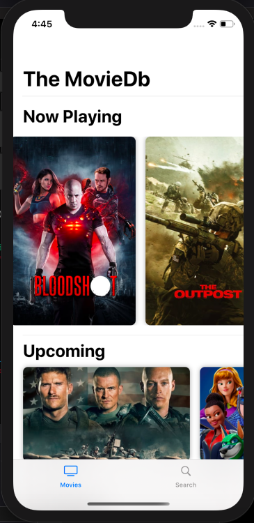
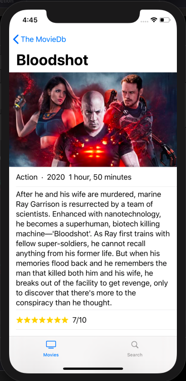

# MovieDB
An iOS Movie app made using SwiftUI. Uses the TMDb API to show Movie Carousels and their detials. Also has search.

## Screenshots

## To Run
- Clone repo using Xcode Source Control
- Vist [TMDb](https://www.themoviedb.org/documentation/api) and sign up for an API Key
- Open up MovieDB/Service/MovieStore.swift and replace "YOUR_API_KEY" with your own
- Run app on preferred simulator

## Requirement
- iOS 13.x
- Xcode 11.x
